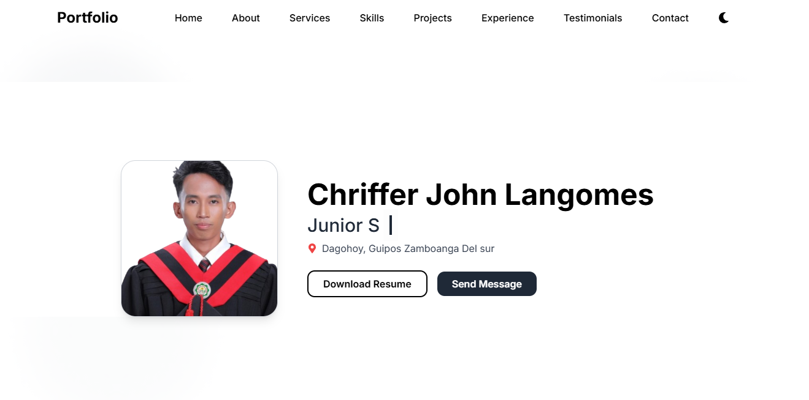

# Portfolio - Chriffer John Langomes



A modern, responsive portfolio website built with Next.js, React, and Tailwind CSS. Showcasing projects, skills, testimonials, and more.

## 🚀 Features

- Beautiful, mobile-friendly design
- Animated loading spinner
- Light & dark mode support
- Project gallery with add/view functionality (localStorage)
- Skills, experience, and testimonials sections
- Contact information and social links
- Feedback system

## 🛠️ Tech Stack

- [Next.js](https://nextjs.org/)
- [React](https://react.dev/)
- [Tailwind CSS](https://tailwindcss.com/)
- [TypeScript](https://www.typescriptlang.org/)
- [React Icons](https://react-icons.github.io/react-icons/)

## 📦 Getting Started

1. **Clone the repository:**
   ```bash
   git clone https://github.com/your-username/your-portfolio.git
   cd your-portfolio
   ```
2. **Install dependencies:**
   ```bash
   npm install
   # or
   yarn install
   ```
3. **Run the development server:**
   ```bash
   npm run dev
   # or
   yarn dev
   ```
4. **Open in your browser:**
   Visit [http://localhost:3000](http://localhost:3000)

## 🖼️ Project Structure

- `/app` - Next.js app directory (pages, layout, API routes)
- `/components` - Reusable React components
- `/public` - Static assets (images, resume, etc.)
- `/styles` - Global styles (Tailwind)

## ✨ Customization
- Update your info in `/components/Home.tsx`, `/components/About.tsx`, etc.
- Add or edit projects in `/components/Projects.tsx` or via the Add Project UI.
- Update skills, testimonials, and contact info as needed.

## 📤 Deployment
You can deploy this project to [Vercel](https://vercel.com/), [Netlify](https://www.netlify.com/), or any platform that supports Next.js.

## 🙏 Credits
- Developed by **Chriffer John Langomes**
- Inspired by modern portfolio designs
- Icons by [React Icons](https://react-icons.github.io/react-icons/)

## 📬 Feedback
Feel free to open an issue or submit feedback via the website! 